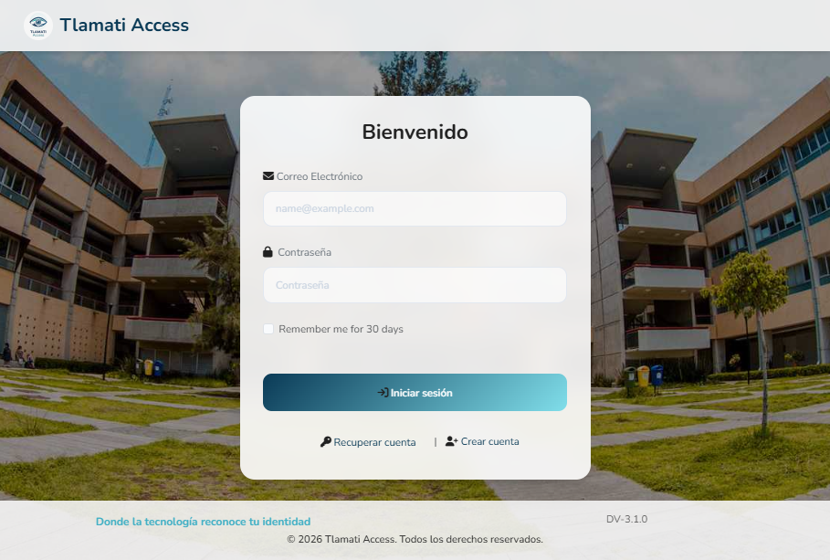
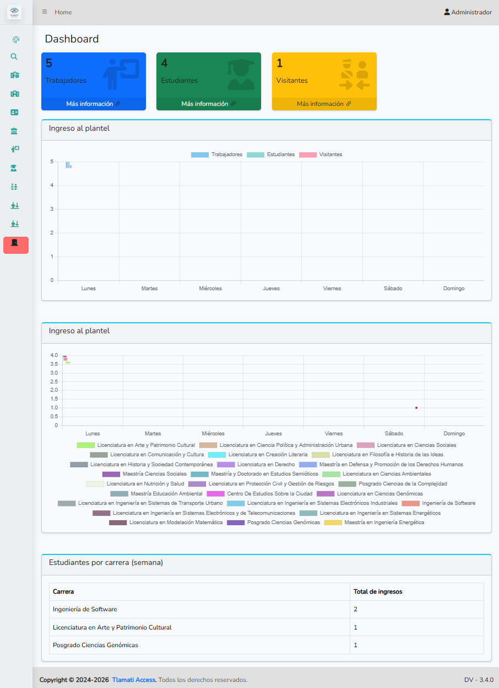
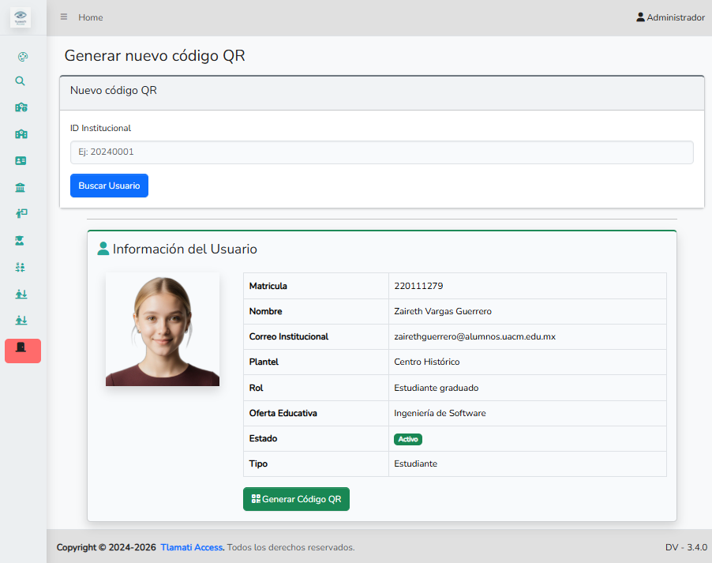
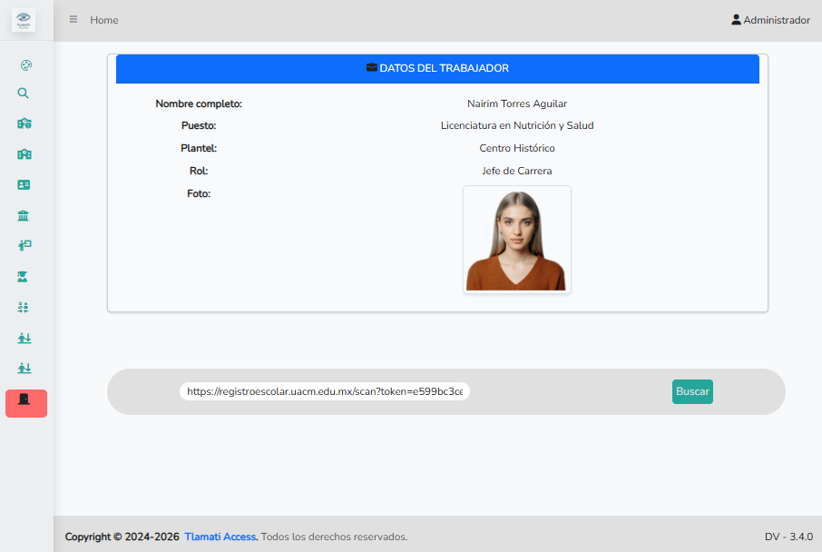
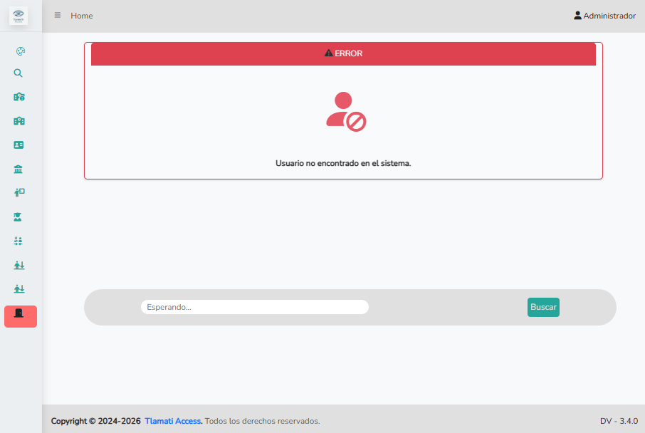

# Tlamati Access

## Sistema Inteligente de Gestión y Control de Acceso Institucional para la UACM

  <!-- Ícono o logotipo del proyecto -->
  

  <strong>Implementación en:</strong> Universidad Autónoma de la Ciudad de México (UACM) | Plantel Cuautepec GAM 1

  
  <a href="https://www.php.net/">
    =8.2">
  </a>
  
  

---

## Tabla de contenidos

- [1. Introducción](#1-introducción)
- [2. Propósito del proyecto](#2-propósito-del-proyecto)
- [3. Colaboración corporativa](#3-colaboración-corporativa)
- [4. Stack tecnológico](#4-stack-tecnológico)
- [5. Evolución del producto](#5-evolución-del-producto)
- [6. Características mejoradas del Ciclo III](#6-características-mejoradas-del-ciclo-iii)
- [7. Arquitectura y control de versiones](#7-arquitectura-y-control-de-versiones)
- [8. Requisitos técnicos](#8-requisitos-técnicos)
- [9. Instalación](#9-instalación)
- [10. Versiones lanzadas](#10-versiones-lanzadas)
- [11. Historial de versiones](#11-historial-de-versiones)
- [12. Capturas del sistema](#12-capturas-del-sistema)
- [13. Licencia](#13-licencia)

---

## 1. Introducción

Tlamati Access es una plataforma integral y avanzada diseñada para modernizar completamente los protocolos de ingreso a instituciones educativas críticas. En un entorno donde la seguridad física está constantemente amenazada por métodos de identificación vulnerables, como fotocopias o credenciales físicas clonadas, nuestro sistema eleva la gestión del acceso a estándares criptográficos y biométricos de vanguardia.

Nuestro objetivo principal es resolver una brecha crítica: la fricción entre la alta demanda de flujo de personas en las entradas y la necesidad absoluta de garantizar una validación infalsificable para el personal de seguridad. Tlamati Access garantiza eficiencia operativa sin sacrificar un nivel superior de seguridad, protegiendo así al plantel, su comunidad y sus activos.

---

## 2. Propósito del proyecto

El proyecto está diseñado para transicionar los procesos manuales de control de acceso a un ecosistema digital inteligente que ofrece:

- **Seguridad cero confianza:** cada interacción es tratada como una potencial amenaza, requiriendo múltiples capas de validación.
- **Escalabilidad:** la arquitectura modular permite integrar nuevas funcionalidades, como biometría o nuevos tipos de credenciales, sin detener las operaciones existentes.
- **Trazabilidad forense:** registro completo e inmutable de quién, cuándo y por qué accedió a las instalaciones, esencial para auditorías de seguridad y gestión de crisis.

---

## 3. Colaboración corporativa

Este proyecto es el resultado de una alianza tecnológica estratégica entre dos corporaciones líderes en desarrollo de software: **AETHR Dynamics** y **Studio Nails My**. La unión de estas fuerzas especializadas ha permitido combinar la visión gerencial y la experiencia en experiencia de usuario con un desarrollo técnico robusto y avanzado, garantizando un producto que no solo es seguro, sino también usable y adaptado al entorno académico mexicano.

---

## 4. Stack tecnológico

Tlamati Access fue desarrollado utilizando un stack tecnológico moderno y de alto rendimiento, asegurando escalabilidad y baja deuda técnica:

- **Backend:** Laravel v13 (PHP Framework), para la lógica de negocio central y gestión de APIs.
- **Base de datos:** PostgreSQL (`pgsql`), gestor robusto, confiable y preparado para grandes volúmenes de datos transaccionales.
- **Análisis avanzado:** Python, utilizado específicamente para módulos de análisis biométrico y detección de patrones en documentación oficial con OpenCV.

---

## 5. Evolución del producto

Tlamati Access no fue un desarrollo único; es el resultado de una evolución planificada en múltiples fases, demostrando su adaptabilidad y capacidad de mejora continua.

1. **Fase I - Fundacional:** se estableció la base operativa con un sistema inicial basado en códigos QR dinámicos.
2. **Fase II - Refinamiento:** el sistema evolucionó hacia plataformas web robustas, mejorando la gestión de roles y el control de acceso.
3. **Ciclo III - Tlamati Access (versión actual):** esta fase representa un salto importante en seguridad. Integramos tecnologías avanzadas para crear una solución de doble autenticación, haciendo que la validación de identidad sea prácticamente infalsificable.

---

## 6. Características mejoradas del Ciclo III

Las mejoras introducidas en la última etapa representan el valor principal para la UACM:

- **Autenticación criptográfica dinámica:** implementación de códigos QR generados al momento y con uso único, eliminando cualquier riesgo asociado a credenciales estáticas o clonables.
- **Reconocimiento facial (biometría):** módulo avanzado que actúa como una capa de doble autenticación para agilizar el ingreso sin comprometer la seguridad.
- **Validación documental con IA:** uso de análisis avanzados para detectar inconsistencias o falsificaciones en identificaciones oficiales mediante algoritmos entrenados.

---

## 7. Arquitectura y control de versiones

El sistema mantiene un protocolo estricto de desarrollo basado en ramas funcionales para garantizar la estabilidad de producción:

| Rama | Descripción | Propósito |
|------|-------------|-----------|
| `main` | Contiene el código base estable y certificado. | Versión lista para producción, sin funcionalidades de riesgo. |
| `App_Movil_Qr` | Desarrollo de la aplicación para el sistema operativo Android, creada para usarse por parte de los estudiantes y trabajadores que pertenecen a la Universidad Autónoma de la Ciudad de México. El backend fue desarrollado con la plataforma Firebase, que tiene respaldo de Google.  |
| `Docs` | Documentos desarrollados durante el desarrollo del proyecto, estando en su última versión y correspondientes con la etapa de desarrollo III. Todos en formato .PDF, respaldando el proceso de desarrollo y la metodología SCRUM llevada a cabo.  |
| `feature/dv-01.05.00` | Primera versión lanzada del sistema web, desarrollada en la versión 13 de Laravel, contando con la estructura de base de datos establecida en las reuniones y documentación previas.  |
| `feature/qr` | Integración del QR en el sistema Web, para su posterior integración con el sistema principal. |
| `react-native-dev` | Diseño de la aplicación móvil para Android, usando los estilos del proyecto (paleta de colores y fuente de letra) establecidos en el Manual de Identidad. No tiene implementada ninguna funcionalidad; es solo el diseño a seguir para su posterior desarrollo. |

### Historial detallado del Ciclo III

Cada mejora ha sido versionada meticulosamente en ramas específicas para asegurar la trazabilidad completa:

- **3.1.0:** implementación de arquitectura MVC, módulos Seed y Factory, e integración de visualizaciones analíticas (Dashboard).
- **3.2.0:** desarrollo detallado de permisos de roles (CRUD) con mecanismos avanzados contra inyección de formularios.
- **3.2.1:** creación de vistas uniformes para gestión de errores HTTP, mejorando la experiencia de usuario ante fallas.
- **3.3.0:** funcionalidad crítica: lectura avanzada de códigos QR con hardware y generación automatizada de reportes PDF.
- **3.4.1:** sistema de notificaciones inter-usuarios y módulo avanzado (OpenCode) para análisis de credenciales oficiales.
- **3.5.0:** implementación rigurosa de pruebas unitarias y suites completas de seguridad.
- **3.6.0:** integración completa del motor de reconocimiento facial en la plataforma web, cerrando el ciclo de autenticación de doble factor.

---

## 8. Requisitos técnicos

### Stack requerido

- **PHP** 8.2 o superior
- **Laravel** v13
- **PostgreSQL** en su versión más reciente disponible para `pgsql`
- **Node.js** y **npm**
- **Python 3.x** para módulos de biometría y análisis
- **Hardware:** terminales con lectores QR y cámaras IP de alta resolución

---

## 9. Instalación

### Clonar repositorio principal

git clone https://github.com/Aethr-Dynamics/Tlamati_Access.git tlamati-access
cd tlamati-access

### Instalar dependencias PHP y Node.js
composer install --no-dev
npm install

### Configurar entorno
cp .env.example .env
php artisan key:generate

Editar el archivo .env y establecer la conexión con PostgreSQL:

* DB_CONNECTION=pgsql
* DB_HOST=127.0.0.1
* DB_PORT=5432
* DB_DATABASE=nombre_de_la_base
* DB_USERNAME=usuario
* DB_PASSWORD=contraseña

### Crear un acceso público a storage.
php artisan storage:link

### Ejecutar migraciones y seeders
php artisan migrate --seed

### Compilar assets frontend
npm run build

### Ejecutar el proyecto en local
php artisan serve

---

## 10. Versiones lanzadas
| Versión   | Característica principal | Descripción técnica |
| --------- | ----------------------------------------- | ------------------------------------------------------------------------------------------ |
| **3.1.0** | Arquitectura MVC y visualización de datos | Integración de Seed, Factory y vistas analíticas con gráficas de usuarios ingresados al plantel. |   
| **3.2.0** | Control de acceso basado en roles (RBAC)  | Desarrollo de CRUD dependientes del perfil de usuario e implementación de medidas contra inyección SQL/XSS.                        |
| **3.2.1** | Experiencia de usuario                    | Módulo unificado de vistas de errores HTTP estándar, mejorando la resiliencia visible.                                             |
| **3.2.2** | DatasetDataset sintético de fotografías | Fotografías tipo identificación oficial para los trabajadores y estudiantes. |
| **3.2.3** | Token Seguro para código QR | El QR está conformado por un token aleatorio que reemplaza la matrícula en el QR. Es un string aleatorio que no revela la matrícula y un hash criptográfico para verificar la integridad del usuario.  |
| **3.3.0** | Lectura              | Implementación de lectura física de códigos QR con hardware especializado. |
| **3.4.0** | Refinamiento para le  Backlog | Se definen los  KPIs para determinar si el proyecto va bien. Estan integrados en la ruta /docs/. Tomando el documento  'Especificaciones de requisitos de software (SRS)', se inició el proceso de descomponer historias grandes (épicas → historias pequeñas), aclarar requisitos ambiguos. Además, se agregaron criterios de aceptación y estimar esfuerzo (story points). |

---

## 11. Historial de versiones
| Versión   | Característica principal                  | Descripción técnica |
| --------- | ----------------------------------------- | ------------------------------------------------------------------------------ |
| **3.4.1** | Notificación e identidad digital          | Sistema avanzado de notificaciones en tiempo real entre usuarios y módulo OpenCode para análisis seguro de credenciales oficiales. |
| **3.5.0** | Quality Assurance (QA)                    | Desarrollo y ejecución de pruebas unitarias completas y suites de seguridad automatizadas.                                         |
| **3.6.0** | Biometría integrada                       | Finalización e integración exitosa del motor de reconocimiento facial en el backend web.                                           |

---

## 12. Capturas del sistema

### Login

  

    Login del sistema Tlamati Access.

### Panel principal de administración

  

  Vista principal del sistema Tlamati Access con monitoreo en tiempo real.

### Generación segura de códigos QR

  

  Sistema de generación criptográfica de códigos QR institucionales.

### Escaneo y validación de acceso

  

  Validación instantánea del token y despliegue de identidad institucional.

### Usario no existente

  

  Código QR no existe en el sistema o no pertenece al sistema.

---

## 13. Licencia
Aviso legal de propiedad intelectual

EL CÓDIGO FUENTE, DOCUMENTACIÓN Y ARTEFACTOS CONTENIDOS EN ESTE REPOSITORIO SON MATERIAL PROTEGIDO POR DERECHO PRIVATIVO.

Este proyecto opera bajo una licencia propietaria exclusiva. El uso de esta plataforma no está sujeto a ninguna licencia de código abierto (MIT, GPL, Apache, etc.). Cualquier intento de modificar, reproducir, vender, ceder o publicar cualquier parte del código fuente o documentación sin la autorización expresa y por escrito de AETHR Dynamics y Studio Nails My constituye una violación directa al presente convenio y está sujeto a acciones legales civiles y penales.
